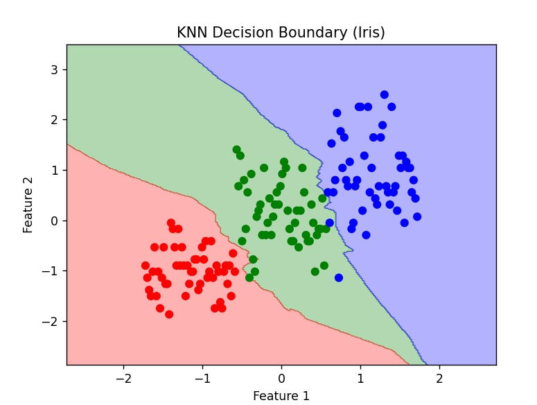

# K-Nearest Neighbors Classification

## Objective
The objective of this project is to understand and implement the K-Nearest Neighbors (KNN) algorithm for classification using the Iris dataset.

---

## Tools and Technologies
Python  
Pandas  
NumPy  
Scikit-learn  
Matplotlib  

---

## Dataset
Iris Dataset (Iris.csv)

The dataset contains features of flowers such as sepal length, sepal width, petal length, and petal width, used to classify different species of Iris flowers.

---

## Workflow

### Data Preprocessing
Loaded dataset using pandas  
Separated features and target variable  
Converted categorical labels to numerical values if required  

### Feature Scaling
Applied StandardScaler to normalize the feature values  

### Model Training
Used KNeighborsClassifier from sklearn  
Trained model with different values of K  

### Model Evaluation
Evaluated model using accuracy  
Generated confusion matrix  

### Visualization
Plotted decision boundary using two features  
Visualized how KNN separates different classes  

---

## Results
Model performs well on the Iris dataset  
Accuracy varies with different values of K  
Decision boundary clearly shows class separation  

---

## Output

KNN Decision Boundary (Iris Dataset)  

---

## How to Run

Install required libraries  
pip install pandas numpy matplotlib scikit-learn  

Run the program  
python knn_classification.py  

---

## Project Structure

K-Nearest-Neighbors-Classification/

Iris.csv  
knn_classification.py  
knn_decision_boundary.jpg  
README.md  

---

## Conclusion
Successfully implemented KNN classification, evaluated performance, and visualized decision boundaries using the Iris dataset.

---

## Key Learning
KNN is a simple and effective classification algorithm  
Normalization is important for distance-based models  
Choosing the right value of K improves performance  
Decision boundary helps visualize model behavior  
